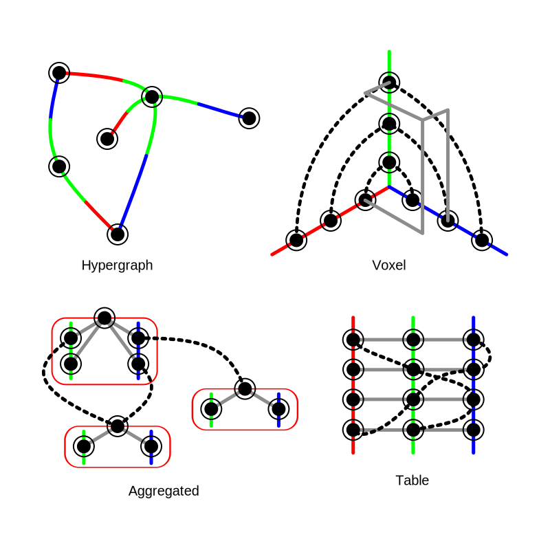

# User Interface
The user interface unites visualizer, editor and debugger into one.
It is an integrated development environment which is not only meant for developers.

## Getting Started
It is best to checkout the [umbrella repository](https://github.com/Symatem/Symatem),
because it ensures the compatibility of all submodules / repositories.
Then go into your local copy of the [UserInterface repository](https://github.com/Symatem/UserInterface)
and open index.html in a browser of your choice either directly
(make sure to disable local file restrictions and cross origin policies) or host it using [Node.JS](https://nodejs.org/) for example.
Alternatively, you can also try the bleeding edge [online version](https://symatem.github.io/UserInterface/index.html).
The user interface is optimized for Firefox but also actively maintained on Safari.

## Reasoning

### Triples
There are 4 mathematically equivalent different ways to visualize Triples:

- Hypergraph:
Every Symbol is a point in a arbitrary space (in you imagination it might be 2D or 3D),
Each data field is like a leave hanging from a Symbol
and Triples are a strange kind of edges but not between two Symbols but three of them,
having a direction from ... via ... through to ...

- Aggregated:
Personally I think of this as the most appealing form.
It is a modification of the normal graph.
Entities and their Attributes are collected in a Block with edges leading to their Values.

- Table:
If you come from standard relational SQL databases,
this might be familiar to you:
All triples are in a big table with these three columns: Entity, Attribute, Value.

- Voxel:
And if you come from a mathematical school, you might find this form reasonable.
Every triple is a point in a 3D cartesian coordinate system.
The three axises are: Entity, Attribute, Value.
Little extra: A slice from the Entity/Value plane can be seen as a
[logical matrix](https://en.wikipedia.org/wiki/First-order_logic#Examples)
of an Attribute.

### Projectional Editing
If you are not familiar with the idea:
[Here](https://cloudalion.org/2016/05/29/whats-the-deal-with-projectional-editing/) is a good introduction.

Advantages:
- Things that become unnecessary:
    - No scanning / lexing / parsing needed
    - No syntax errors and different styles anymore
    - No need for names (usually called symbols) to connect the sequence / hierarchy into a graph
- Easier to release new versions / standards
    - Ground truth: Enforces clear distinction between semantics and representation / decoration
    - More homogenous structures / interfaces
    - Far less primitives, most can be moved to the standard library
    - Can be far more customized / domain specific (like DSLs)
- Transformability (Program is just data like any other)
    - Better meta programming and reflection / reification
    - Better for machines to operate on
    - More and potentially better code complexity measure than LOC (lines of code)

Disadvantages:
- Geometry improves orientation inside the source code for some people and it is hard to project this additional non-semantics forward and backward
- Currently tools like GIT are optimized for sequences / text
- Can not make errors / produce an invalid outcome on purpose
